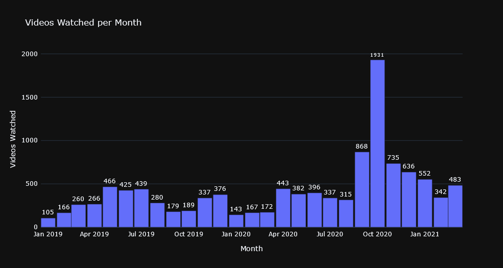
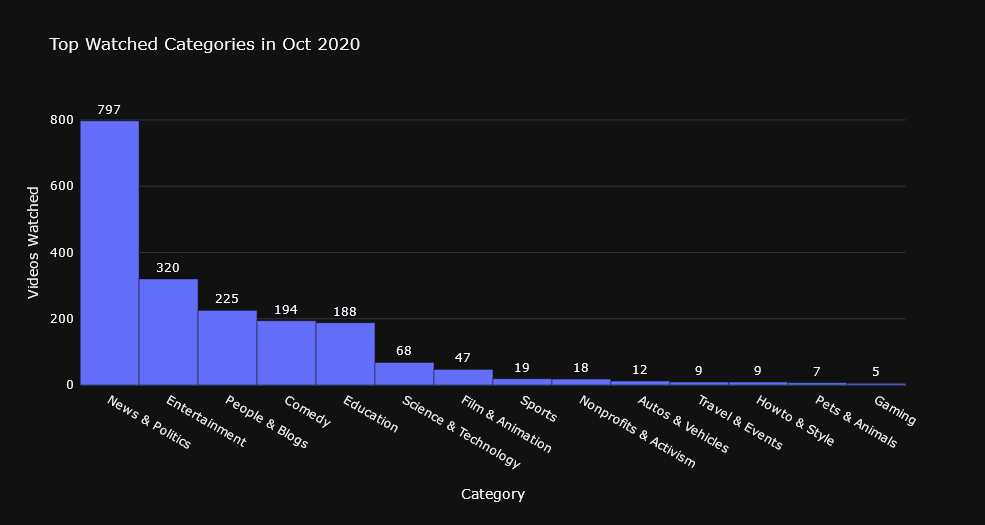
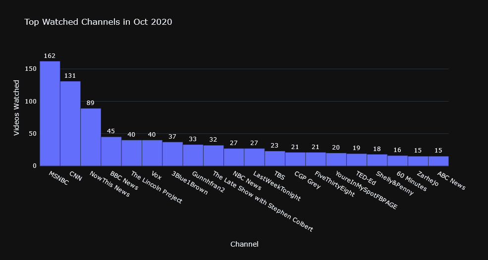

# Understanding my time spent on YouTube

Recently, I feel like my time on YouTube has increased considerably. So I was really curious to understand more about how I am spending that time. And hence this quick project. Or more like an exercise in Python.


## First, we need data

For this, I headed to [Google Takeout](https://takeout.google.com/settings/takeout) and dowloaded the *YouTube and YouTube Music* data linked to my Google account in an easy-to-work-with JSON format. Of the downloaded items, we are only interested in the file watch-history.json. So I extracted it and stored it in my working directory. 


## Google API Client

Since we are going to need Google's YouTube Data API, we need to head to https://console.developers.google.com/ and create a project, activate YouTube Data API and get the API credentials. This [video](https://www.youtube.com/watch?v=th5_9woFJmk) shows how. Alright, now we have everything we need to get started.


## Some helpful libraries

```python

import json
import pandas as pd
from googleapiclient.discovery import build
from datetime import datetime
import datetime
import plotly.express as px
import plotly as ply
ply.offline.init_notebook_mode(connected=True)
import pytz
import numpy as np

ytAPI = '''My Google API Key'''

```


## Importing the data

Once we have the required libraries installed, the next thing to do is to import the watch-history.json data.

```markdown

ytWatchHistory = json.load(open("yt-watch-history.json"))

```

Next, we will reformat this data into a nice DataFrame which will be better to work with.

```python

titleUrl = []
time = []
header = []

for i in ytWatchHistory:
    if ('titleUrl' in i) and ('time' in i): 
        titleUrl.append(i["titleUrl"])
        time.append(i["time"])
        header.append(i["header"])
        
df = pd.DataFrame(list(zip(header, titleUrl, time)), columns = ["Header", "Url", "Time"])

```

Great. Now we have our watch history in a nice DataFrame with columns Header (which denotes if the service is YouTube or YouTube Music), Title (Title of the video), URL (URL of the video), Time (Time of watch). Note that, right now the Time is stored as String. We have to convert it to a DateTime datatype.

```python

df["Time"] = df["Time"].str.split(".", expand=True)[0]
df["Time"] = pd.to_datetime(df["Time"], format='%Y-%m-%dT%H:%M:%S', utc=True)
df["Time"] = df["Time"].dt.tz_convert('Asia/Kolkata')

```

Now I don't want to look at all the data. I just want to consider my watch history between Jan of 2019 to March of 2021. Let's filter out the data that is out of this time range.

```python

fr = datetime.datetime(2019,1,1,0,0,0,0, pytz.timezone('Asia/Calcutta'))
df = df.loc[(df["Time"]>fr)]

to = datetime.datetime(2021,4,1,0,0,0,0, pytz.timezone('Asia/Calcutta'))
df = df.loc[(df["Time"]<to)]

df = df.reset_index().drop('index', axis=1)

```

We can't stop there. Notice that this DataFrame has data from both YouTube and YouTube Music. But I don't want to consider YouTube Music as I only use it for backgroud playing while I am doing some other work. So YouTube Music is not really something I actively spend my focus on. So let's remove that and store it a separate variable, just in case we want to do something with it in the future. 

```python

dfYTMusic = dfYTMusic.reset_index().drop('index', axis=1)

df = df.reset_index().drop('index', axis=1)

```


## Making API calls

Before calling the API, there is just a small thing to do. We want information such as Title, Channel, Category and Tags associated with each video in the DataFrame. So let's create new empty columns in the DataFrame to accomodate that data. Also, we need an identifier to pass with the API call to tell Google what video we want the information about. Thankfully, the Id for each video is at the end of the video URL. So let's extract that Id from the URL and store it in a new column - Id

```python

df["Title"] = None
df["Category"] = None
df["Channel"] = None
df["Tags"] = None

df["Id"] = df["Url"].str.split("v=", expand=True)[1]

```

Now we are ready to make our API calls. Google happen to have a great [documentation](https://developers.google.com/youtube/v3/docs) on their API methods. That makes the job easy. 

First, let's build a API Service object according to the documentation.

```python

youtube = build('youtube', 'v3', developerKey=ytAPI)

```

Once we are done with that, now we can call API methods on all the rows in our DataFrame. The following snippet of code basically goes to each row and get the Id of the video. Then it calls the YouTube API. We want the information about the Video. So we pass the Videos() reference along with the API call to indicate what information we want. Then we parse the response and store it in the respectives rows in the DataFrame.

```python

for i in range(len(df)):
    
    try:
        request = youtube.videos().list(part='snippet', id=df.loc[i]['Id'])
        res = request.execute()
        try:
            df.loc[i,'Title'] = res['items'][0]['snippet']['title']
            df.loc[i,'Channel'] = res['items'][0]['snippet']['channelTitle']
            df.loc[i,'Category'] = res['items'][0]['snippet']['categoryId']
            df.loc[i,'Tags'] = str(res['items'][0]['snippet']['tags']).replace("[",'').replace("]",'')
        except:
            continue
    
    except:
        continue

```


## Data Cleaning

Alright. Now we have the required data for all the rows (videos). But there can be few instances where a video's related have not been retrieved. This is probably becuase the video might have been taken down or it could have been a private video. So let's first go ahead and drop these rows. 

```python

df = df.loc[~df['Title'].isnull()]
df.reset_index(inplace=True)
df.drop('index', axis=1, inplace=True)

```

Notice that we have a column called Category. This essentially specifies what category a particular video belongs to such as Music, Education, Entertainment, Comendy and so. But this information is not provided explicityly but as codes. Each code denotes a different category. So now we have to get the Category name for each of these codes. Thankfully, YouTube API has a VideoCategories() reference. We can use this to get the required information. 

```python

request = youtube.videoCategories().list(part='snippet', regionCode='US')
cat = request.execute()

catDict = {}

for i in cat['items']:
    catDict.update({i['id']:i['snippet']['title']})

```

Perfect. Now we have a dictionary which has the mapping of these codes and the respective Category names. So let's use this dictionary to replace the codes in our DataFrame. 

```python

df = df.replace({'Category': catDict})

```

Personally, I have a habit of keeping YouTube in the background playing songs on Autoplay while I do something else. So I am not actively spending my time on YouTube when I listen to music. So I should probably remove Music related videos completely from the DataFrame to get a accurate sense of my time spent on YouTube. Let's do that. Let's create a new DataFrame which doens't have any music related videos. We can do this by excluding all the Videos that are associated with the Category Music. This is not 100% accurate as there can be some non-music videos that might be tagged as Music. But it's a small number. So that's fine.

```python

df_ = df.loc[~(df['Category']=='Music')]
df_.reset_index(inplace=True)
df_.drop('index', axis=1, inplace=True)

```

That's it. We have the data that we need to start plotting to get a sense of my time on YouTube.

## Plots

- ### My YouTube Watch Actvity Distribution Since 2019

Let's plot a histogram type plot of the Time column. This will show how many videos I have been watching on YouTube every month. 

```python

df_['Year-Month'] = df_['Time'].dt.strftime('%Y-%m')
tempDF = pd.pivot_table(df_, index='Year-Month', values='Title', aggfunc=lambda x:x.count())
tempDF.reset_index(inplace=True)
tempDF.columns = ['Year-Month','Videos Watched']

fig = go.Figure()
fig.add_trace(go.Bar(y=tempDF['Videos Watched'], 
                     x=tempDF['Year-Month'], 
                     text=tempDF['Videos Watched'], 
                     textposition='outside'))

fig.update_layout(
    bargap=0,
    margin=dict(pad=5,l=80),
    template='plotly_dark',
    title='Videos Watched per Month',
    xaxis=dict(title=dict(text='Month')),
    yaxis=dict(title=dict(text='Videos Watched',standoff=0), automargin=True)
)

```


Okay. It's pretty clear I was doing okay until August of 2020 after which there has been a big surge. Not to mention, in October my watch activity has nearly quadrupled. Let me look at the month alone and see if I can figure out the reason. 

- ### What happened in the month of Oct 2020?

Alright. So here I am plotting the top 20 categories I watched during the month of Oct 2020. Let's see if that helps. 

```python

tempDF = pd.DataFrame(df_.loc[df_['Year-Month']=='2020-10']['Category'].value_counts()[0:20])
tempDF.reset_index(inplace=True)
tempDF.columns = ['Category','Videos Watched']

fig = go.Figure()
fig.add_trace(go.Bar(y=tempDF['Videos Watched'], 
                     x=tempDF['Category'], 
                     text=tempDF['Videos Watched'], 
                     textposition='outside'))

fig.update_layout(
    bargap=0,
    margin=dict(pad=5,l=80,b=140),
    template='plotly_dark',
    title='Top Watched Categories in Oct 2020',
    xaxis=dict(title=dict(text='Category')),
    yaxis=dict(title=dict(text='Videos Watched',standoff=0), automargin=True, range=[0,860])

)

```



And the top 20 channels in the month of Oct 2020.

```python

tempDF = pd.DataFrame(df_.loc[df_['Year-Month']=='2020-10']['Channel'].value_counts()[0:20])
tempDF.reset_index(inplace=True)
tempDF.columns = ['Channel','Videos Watched']

fig = go.Figure()
fig.add_trace(go.Bar(y=tempDF['Videos Watched'], 
                     x=tempDF['Channel'], 
                     text=tempDF['Videos Watched'], 
                     textposition='outside'))

fig.update_layout(
    bargap=0,
    margin=dict(pad=5,l=80,b=190),
    template='plotly_dark',
    title='Top Watched Channels in Oct 2020',
    xaxis=dict(title=dict(text='Channel')),
    yaxis=dict(title=dict(text='Videos Watched',standoff=0), automargin=True, range=[0,180])

)

```



You can use the [editor on GitHub](https://github.com/arun-sp/YouTubeAnalytics/edit/main/docs/index.md) to maintain and preview the content for your website in Markdown files.

Whenever you commit to this repository, GitHub Pages will run [Jekyll](https://jekyllrb.com/) to rebuild the pages in your site, from the content in your Markdown files.

### Markdown

Markdown is a lightweight and easy-to-use syntax for styling your writing. It includes conventions for

```markdown
Syntax highlighted code block

# Header 1
## Header 2
### Header 3

- Bulleted
- List

1. Numbered
2. List

**Bold** and _Italic_ and `Code` text

[Link](url) and 
```

For more details see [GitHub Flavored Markdown](https://guides.github.com/features/mastering-markdown/).

### Jekyll Themes

Your Pages site will use the layout and styles from the Jekyll theme you have selected in your [repository settings](https://github.com/arun-sp/YouTubeAnalytics/settings/pages). The name of this theme is saved in the Jekyll `_config.yml` configuration file.

### Support or Contact

Having trouble with Pages? Check out our [documentation](https://docs.github.com/categories/github-pages-basics/) or [contact support](https://support.github.com/contact) and we’ll help you sort it out.
